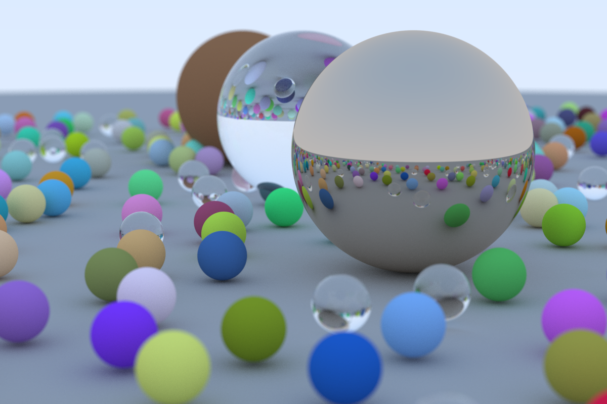

# rust-ray-tracer

Self-learning Rust by implementing a ray tracer following this guide: [Ray Tracing In One Weekend](https://raytracing.github.io/books/RayTracingInOneWeekend.html).  The code is really slow, but I'll find ways to optimize it.

# Current progress:

- [x] Shading via normal vector to sphere
- [x] World and hittable object abstraction
- [x] Anti-aliasing
- [x] Gamma-corrected color intensity rendering of diffuse sphere
- [x] Correct rendering of lambertian sphere
- [x] Correct rendering of regular / fuzzy metal spheres, refactoring tracing code
- [x] Correct rendering of dielectrics
- [x] Randomized scene generation

See [images](images/) for full list of images.