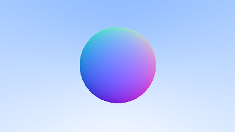

# rust-ray-tracer

Self-learning Rust by implementing a ray tracer following this guide: https://raytracing.github.io/books/RayTracingInOneWeekend.html#thevec3class/variablesandmethods

# Current progress:

Shading via normal vector to sphere

