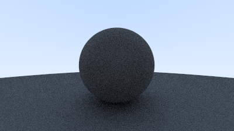

# rust-ray-tracer

Self-learning Rust by implementing a ray tracer following this guide: [Ray Tracing In One Weekend](https://raytracing.github.io/books/RayTracingInOneWeekend.html)

# Current progress:

- [x] Shading via normal vector to sphere
- [x] World and hittable object abstraction
- [x] Anti-aliasing
- [x] Gamma-corrected color intensity rendering of diffuse sphere

See [images](images/) for full list of images.